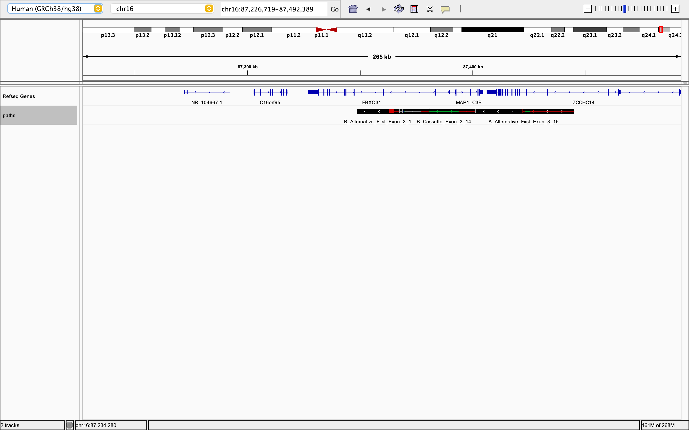

# RNA Splicing Project

## Author
Shanna Badhesha

## Overview of the project

Understand RNA Splicing by utilizing the package Eventpointer and the https://www.bioconductor.org/packages/release/bioc/vignettes/EventPointer/inst/doc/EventPointer.html vignette. I will be using only parts of the vignette that focus on visualization.

## RNA Splicing 

RNA splicing is a step that involves removing introns (aka non-coding regions) from pre-mRNA. This allows for the exons (aka coding regions) to form the mature mRNA which is crucial for protein synthesis. Alternative splicing allows to different combinations of mature mRNA to be formed for protein synthesis. This allows for protein diversity from a single gene. 

Below is a quick breakdown of the steps. 

1. Transcription: DNA is transcribed to pre-mRNA. Pre-mRNA contains both introns (non-coding regions) and exons (coding regions). 
2. Spilceosome: These snRNPs (small nuclear ribonucleoproteins) recoginze the splice sites. Splice sites are where the introns and exons meet. 
3. Splicing: The 5' end of the intron is cleaved. The 3' end of the exon before is then joined to the 5' end of the exon next to it. The intron is then degraded. The process leads to the mature mRNA. 
4. Mature mRNA goes to the nucleas for protein synthesis. 

In genomic testing, RNA-sequencing in addition to DNA-sequencing can be used to produce better results. By detecting abnormalities in RNA splicing compared to healthy data, it can allow one to determine if there are RNA splicing events associated with diseases. 

Information for this section was obtained from the following 2 sites:
https://www.nature.com/scitable/topicpage/rna-splicing-introns-exons-and-spliceosome-12375/
https://www.ambrygen.com/science/peer-reviewed-publication/244/splicing-profile-by-capture-rna-seq-identifies-pathogenic-germline-variants-in-tumor-suppressor-genes

## EventPointer: An effective identification of alternative splicing events using junction arrays and RNA-Seq data

Note: This section focuses on analysis for RNA-seq data. 

### Installing EventPointer

``` {r}
library(BiocManager)

if (!requireNamespace("BiocManager", quietly=TRUE))
    install.packages("BiocManager")

BiocManager::install("EventPointer")
library(EventPointer)
BiocManager::install("SGSeq")
library(SGSeq)
```

### RNA-Seq Analysis

The first step to analyze alternative splicing events in RNA-Seq data, is the creation of the splicing graphs. This step relies entirely on SGSeq R package.

The function PrepareBam_EP transforms all the information found in the bam files into splicing graph features and counts

Samples : Name of the .bam files to be analyzed (Sample1.bam,Sample2.bam,…,etc)
SamplePath: Path where the bam files are stored
Ref_Transc: Reference transcriptome used to name the genes found. Options are: “Ensembl”,“UCSC” or “GTF”.
fileTransc: Path to the GTF reference transcriptome if Ref_Transc is “GTF”.
cores: Number of cores used for parallel processing
Alpha: Internal SGSeq parameter to include or exclude regions

```{r}

 BamInfo<-si
   Samples<-BamInfo[,2]
   PathToSamples <- system.file("extdata/bams", package = "SGSeq")
   PathToGTF<-paste(system.file("extdata",package="EventPointer"),"/FBXO31.gtf",sep="")

   SG_RNASeq<-PrepareBam_EP(Samples=Samples,
                            SamplePath=PathToSamples,
                            Ref_Transc="GTF",
                            fileTransc=PathToGTF,
                            cores=1)
```
### Event Detection

After running PrepareBam_EP, we have all the elements to analyze each of the splicing graphs. The next step is to identify and classify all the events, that are present in the BAM files.

```{r}

data(SG_RNASeq)
   TxtPath<-tempdir()
   AllEvents_RNASeq<-EventDetection(SG_RNASeq,cores=1,Path=TxtPath)
```

### Statstical Analysis

The statistical analysis of the alternative splicing events is done in exactly the same way as for junction arrays. With the Design and Contrast matrices, the algorithm gives the statistical significance and ΔΨ.

```{r}
Dmatrix<-matrix(c(1,1,1,1,1,1,1,1,0,0,0,0,1,1,1,1),ncol=2,byrow=FALSE)
   Cmatrix<-t(t(c(0,1)))
   Events <- EventPointer_RNASeq(AllEvents_RNASeq,Dmatrix,Cmatrix,Statistic="LogFC",PSI=TRUE)
```
### IGV Visualization

EventPointer creates one GTF file that can be loaded into IGV to visualize the alternative splicing events. Figure 6 displays an example result showed in IGV (5th ranked event in Table 2). Also, in the figure a reference transcriptome is displayed (blue track), and it can be seen that the displayed event corresponds to a novel event discovered with sequencing data and that it will not be detected using junction arrays.

```{r}
EventsTxt<-paste(system.file("extdata",package="EventPointer"),"/EventsFound_RNASeq.txt",sep="")
   PathGTF<-setwd("/Users/usc-shannabadhesha/Desktop")
   EventPointer_RNASeq_IGV(Events,SG_RNASeq,EventsTxt,PathGTF)
```
## IGV (Integrative Genomic Viewer)
From SGSeq Vignette: NA-seq reads were mapped to the human reference genome using GSNAP (Wu and Nacu 2010). The analysis is based on BAM files that were subset to reads mapping to a single gene of interest (FBXO31). 

I searched for the FBX031 and got the following image:



This bam file aligned to a single gene (FBX031). 

## Citation
Romero, Juan P., et al. “Comparison of RNA-seq and microarray platforms for splice event detection using a cross-platform algorithm.” BMC genomics 19.1 (2018): 703. doi:10.1186/s12864-018-5082-2

BAM Files obtained from:
Goldstein LD, Cao Y, Pau G, Lawrence M, Wu TD, Seshagiri S, Gentleman R (2016) Prediction and Quantification of Splice Events from RNA-Seq Data. PLoS ONE 11(5): e0156132. doi:10.1371/journal.pone.0156132